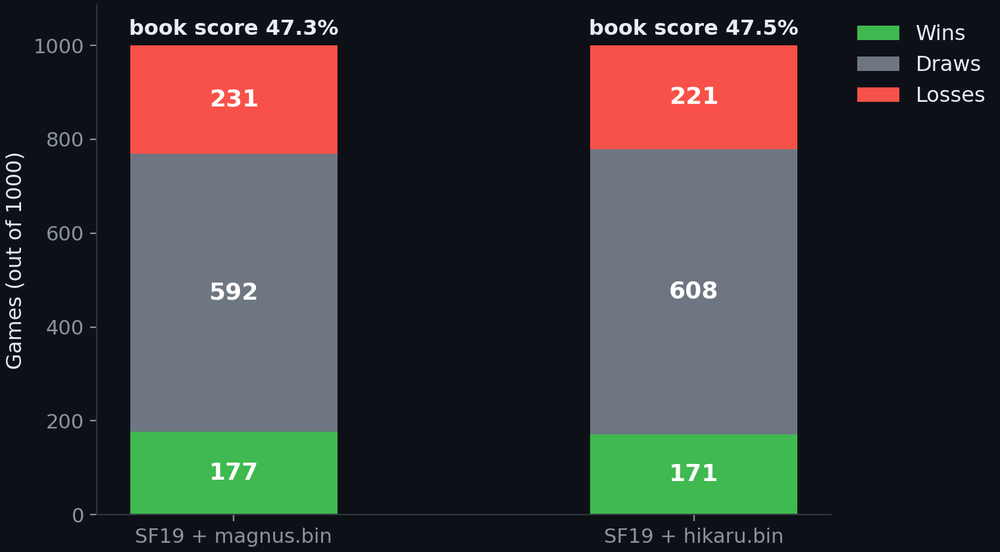

# GM Opening Books

 

Polyglot chess opening books built from real super-GM games. Point your engine at one and it opens like them.

- **magnus.bin** (7 MB, 444,067 positions) — Magnus Carlsen
**hikarulite.bin** (7 MB, 443,154 positions) — Hikaru Nakamura, phone-sized.
Same repertoire as hikaru.bin, slimmed down with simple math: every position
Hikaru played at least twice is kept, plus a deterministic 11.4% slice of the
one-off positions (`key % 100000 < 11432`), landing at the same size as
magnus.bin. Use this one on Android (DroidFish) or anywhere 45 MB is too heavy.
- **hikaru.bin** (45 MB, 2,916,754 positions) — Hikaru Nakamura

## Where the data comes from

Every game pulled from the chess.com published API (`api.chess.com/pub/player/.../games/...`), month by month through September 2026:

- Magnus: 9,454 standard games (Dec 2014 – Sep 2026). Variants and chess960 excluded.
- Hikaru: 68,349 standard games (Jan 2014 – Sep 2026). He plays roughly 7x more than Magnus, hence the bigger file.

All time controls included (rapid, blitz, bullet). No opponent-rating filter — this is the raw repertoire, not a curated "strong opponents only" cut.

## How it was built

Per position: what the GM played, how many times. Weight = frequency — the more they played it, the more often the engine picks it. Standard chess only, capped at 60 plies (opening + early middlegame), standard KxR castling encoding, sorted file for safe binary search.

## Why is magnus.bin so small?

Not an error. Three reasons: Magnus plays far less online (9k vs 68k games), his repertoire is narrow (main-line 1.e4/1.d4 with heavy transpositional overlap into the same positions), and the 60-ply cap trims middlegame tails. Small means dense, not broken.

## Playing style

**magnus.bin — the model student.** White plays 1.e4 (49%) and 1.d4 (32%),
nothing exotic. Against 1.e4: Sicilian (37%) and 1...e5 (25%). Against 1.d4:
1...Nf6 (55%) and 1...d5 (27%). Expect Ruy Lopez, Berlin, Catalan, Sveshnikov —
sound main lines, no surprises. (There are a few bullet jokes buried deep in the
file, like 1.Na3, but you will basically never see them.) Pick this one for
solid openings, engine tournaments, or studying correct theory.

**hikaru.bin — the menace.** White mixes 1.e4 (43%) and 1.d4 (23%) with 1.b3
Larsen (13%). As Black he answers 1.e4 with 1...e5 and the Modern 1...g6 (21%),
and meets 1.d4 with 1...Nf6 or the Modern 1...g6 (34%). Weird from move 2,
every game a different fight — and yes, the Bongcloud is in there (0.3%, about
1 in 300 games). Pick this one for bullet against humans and maximum chaos.

Head-to-head both score the same (47.3% vs 47.5% over 1000 games each), so the
choice is purely about flavor, not strength.

## Random first move variants

Tired of 1.e4 every game? The `-random` twins keep the full GM repertoire but
flatten White's first move to 12 equal options (e4 d4 c4 Nf3 Nc3 e3 d3 g3 b3 f4
c3 b4) — the engine truly picks at random, verified: all 12 appear, junk first
moves (Na3, h4, ...) removed.

- **magnus-random.bin** (7 MB) · **hikaru-random.bin** (45 MB) · **hikarulite-random.bin** (7 MB)

## How to use

Standard polyglot `.bin` — anything that reads polyglot books works: Komodo, Rodent, Arena, Banksia Gui, CuteChess, Scid vs. PC, Lucas Chess, DroidFish on Android (copy into the `DroidFish/book` folder), or Stockfish via the PolyGlot adapter. Outside the book, your engine thinks on its own as usual.

## What it's for

So your engine opens like watching Magnus or Hikaru play: Ruy Lopez + Berlin + Catalan + Sveshnikov à la Magnus, or 1.e4 mixed with 1.b3 and the Bongcloud à la Hikaru (yes, Ke2 made the book). Fun vs humans. For engine-vs-engine tournaments it adds no Elo — that's not how books work.

## Proof: books don't make engines stronger

1000 games each, Stockfish 19 at fixed depth 6, book vs no book — 47.3% (magnus), 47.5% (hikaru).

Full page: [match-1000games.pdf](match-1000games.pdf).

## License

MIT — do whatever you want with it. See LICENSE.
